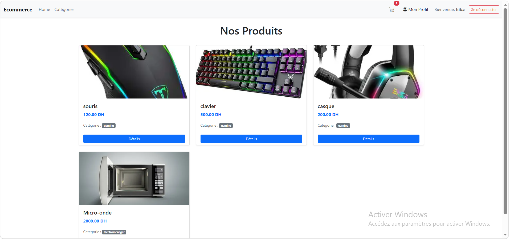
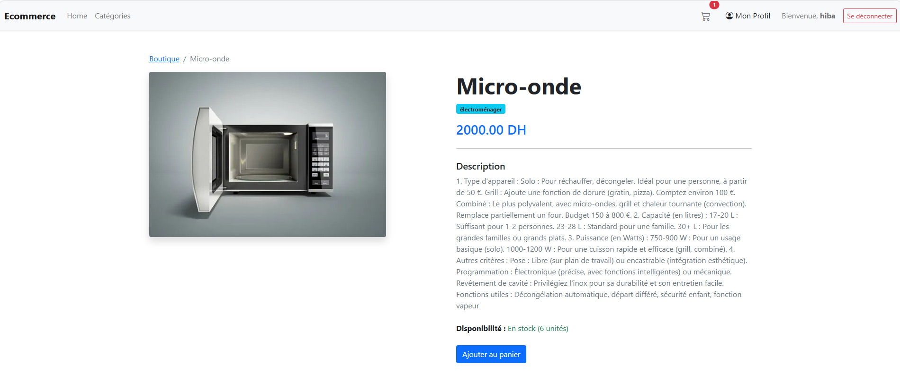
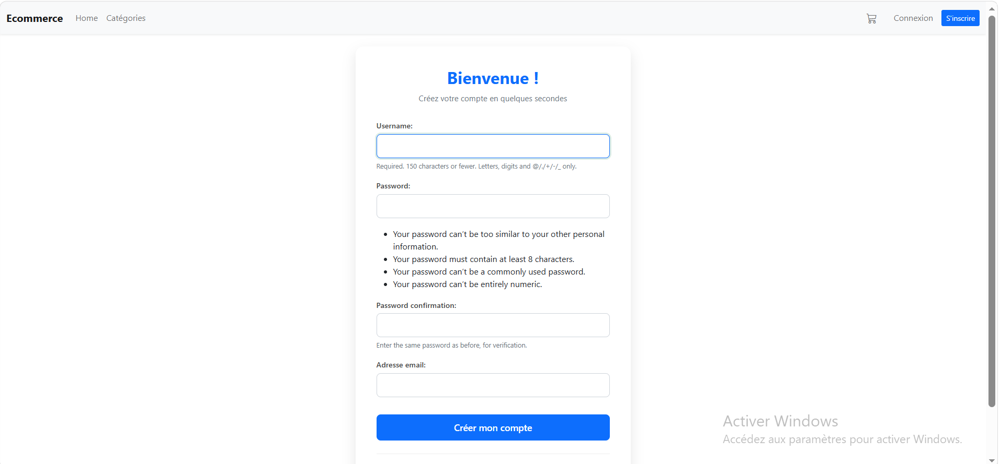
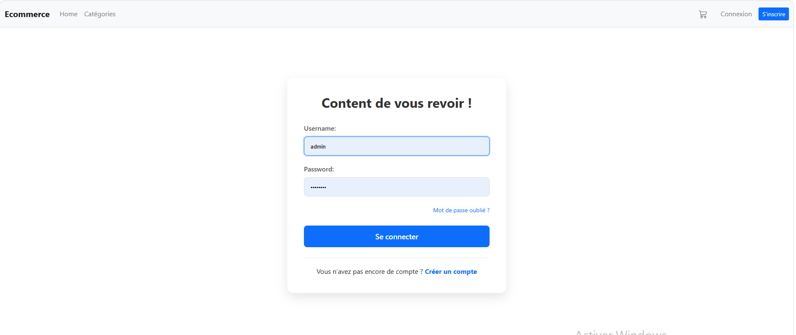
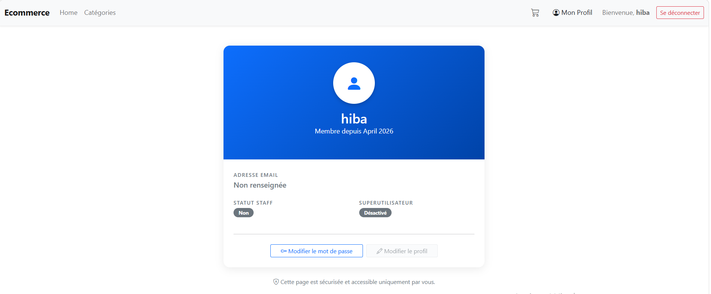
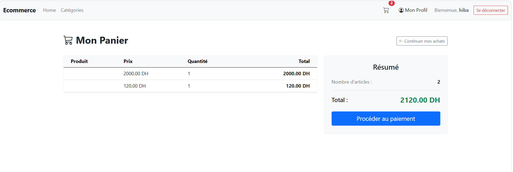
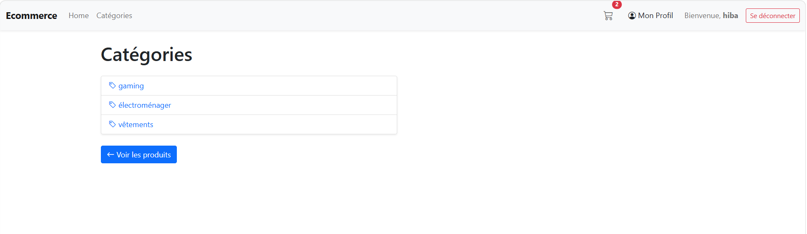

#  E-Commerce Django — Authentification & Catalogue

> Projet Django e-commerce avec système d'authentification complet, catalogue de produits, catégories et panier.

---

##  Aperçu

| Page | Screenshot |
|------|------------|
| Liste des produits |  |
| Détail d'un produit |  |
| Inscription |  |
| Connexion |  |
| Profil |  |
| Panier |  |
| Categorie |  |


---

##  Fonctionnalités

- **Catalogue produits** — liste, détail, images
- **Catégories** — navigation par catégorie
- **Panier** — ajout, suppression, total (via sessions)
- **Authentification** — inscription, connexion, déconnexion
- **Page profil** — protégée par `@login_required`
- **Administration Django** — gestion produits & utilisateurs
- **Base de données MySQL** via Docker

---

##  Architecture du projet

```
ecommerce/
├── ecommerce/              # Configuration principale
│   ├── settings.py
│   ├── urls.py
│   └── wsgi.py
│
├── products/               # Application catalogue
│   ├── models.py           # Product, Category
│   ├── views.py            # product_list, product_detail, cart...
│   ├── urls.py
│   └── templates/products/
│       ├── layout.html
│       ├── products_list.html
│       ├── products_detail.html
│       ├── category_list.html
│       ├── category_detail.html
│       └── cart_detail.html
│
├── accounts/               # Application authentification
│   ├── forms.py            # RegisterForm
│   ├── views.py            # signup, profile
│   ├── urls.py
│   └── templates/registration/
│       ├── login.html
│       ├── signup.html
│       └── profile.html
│
├── images/                 # Médias uploadés
├── docker-compose.yaml     # MySQL via Docker
└── manage.py
```

---

## Installation

### Prérequis

- Python 3.10+
- Docker & Docker Compose (pour MySQL)

### 1. Cloner le projet

```bash
git clone https://github.com/<votre-username>/<votre-repo>.git
cd <votre-repo>/ecommerce_project/ecommerce
```

### 2. Créer et activer l'environnement virtuel

```bash
# Windows
python -m venv myenv
myenv\Scripts\activate

# Linux / macOS
python3 -m venv myenv
source myenv/bin/activate
```

### 3. Installer les dépendances

```bash
pip install django pillow mysqlclient
```

### 4. Lancer MySQL avec Docker

```bash
docker-compose up -d
```

### 5. Appliquer les migrations

```bash
python manage.py migrate
```

### 6. Créer un superutilisateur

```bash
python manage.py createsuperuser
```

### 7. Lancer le serveur

```bash
python manage.py runserver
```

Ouvrir : [http://127.0.0.1:8000](http://127.0.0.1:8000)

---

##  URLs disponibles

| URL | Description |
|-----|-------------|
| `/` | Redirige vers la liste des produits |
| `/products/` | Liste de tous les produits |
| `/products/<id>/` | Détail d'un produit |
| `/products/categories/` | Liste des catégories |
| `/products/category/<id>/` | Produits d'une catégorie |
| `/products/cart/` | Panier |
| `/products/cart/add/<id>/` | Ajouter au panier |
| `/products/cart/remove/<id>/` | Retirer du panier |
| `/accounts/signup/` | Inscription |
| `/accounts/login/` | Connexion |
| `/accounts/logout/` | Déconnexion |
| `/accounts/profile/` | Profil (connexion requise) |
| `/admin/` | Interface d'administration |

---

##  Modèles

### `Category`
| Champ | Type |
|-------|------|
| `name` | CharField (unique) |
| `description` | TextField |
| `created_at` | DateTimeField |

### `Product`
| Champ | Type |
|-------|------|
| `name` | CharField |
| `description` | TextField |
| `price` | DecimalField |
| `stock` | PositiveIntegerField |
| `image` | ImageField |
| `category` | ForeignKey → Category |
| `created_at` | DateTimeField |

---

##  Authentification

- **Inscription** : `RegisterForm` basé sur `UserCreationForm` + champ email
- **Connexion / Déconnexion** : vues Django natives
- **Protection des vues** : décorateur `@login_required`


---

## 🛒 Panier (Sessions)

Le panier est géré via les sessions Django, sans base de données supplémentaire.

```python
cart = request.session.get("cart", {})
cart[str(product_id)] = cart.get(str(product_id), 0) + 1
request.session["cart"] = cart
```

---

##  Docker — MySQL

```bash
docker-compose up -d    # démarrer
docker-compose down     # arrêter
```

---

##  Auteur

| | |
|--|--|
| Nom |Janouj|
| Cours | Atelier Django |
| Année | 2025-2026 |

---


